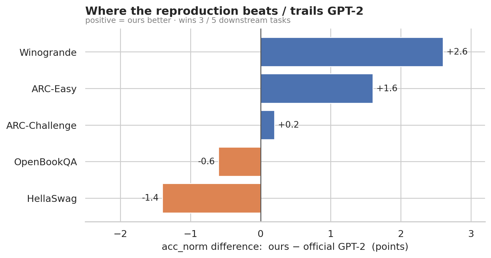
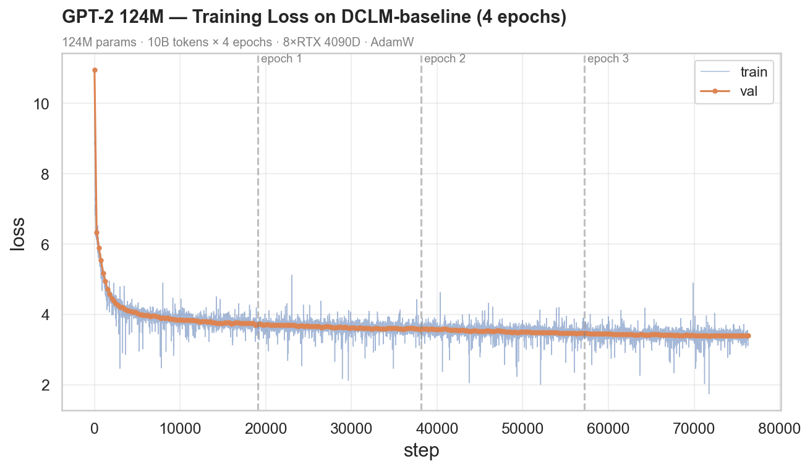
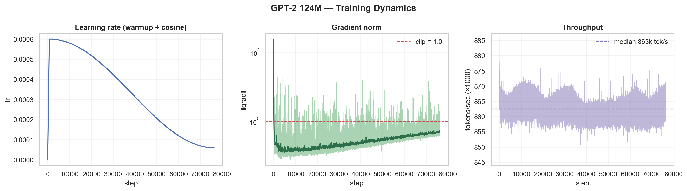
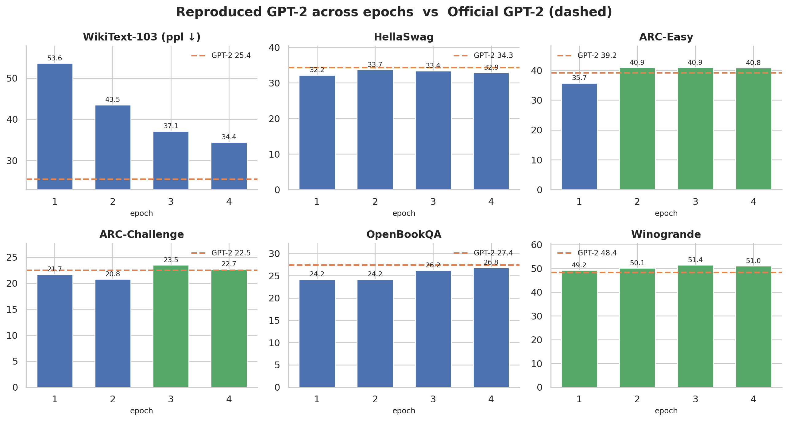

# reproduce-gpt2

<p align="center">
  
</p>

A faithful, **from-scratch reproduction of OpenAI's GPT-2 (124M)** in PyTorch —
architecture, distributed training, and evaluation all written by hand. Trained on
**10B tokens of DCLM-baseline for 4 epochs** on 8×RTX 4090D (~13 h, ~$27), the
model **matches OpenAI's GPT-2 124M on downstream benchmarks** — on par overall,
nominally ahead on 3 of 5 multiple-choice tasks (with honest caveats below).

The implementation mirrors the real GPT-2 closely enough that the official
Hugging Face weights load into it unchanged (logit parity `6.9e-5`).

Inspired by Andrej Karpathy's ["Let's reproduce GPT-2 (124M)"](https://www.youtube.com/watch?v=l8pRSuU81PU)
and [build-nanogpt](https://github.com/karpathy/build-nanogpt); the data choice,
evaluation suite, and analysis below are my own.

**Weights:** 🤗 [zzkai098/gpt2-124m-ckpt](https://huggingface.co/zzkai098/gpt2-124m-ckpt)

---

## Results

Trained model vs. OpenAI's official GPT-2 124M, evaluated head-to-head with the
same code (`scripts/eval.py`). Multiple-choice reports length-normalized accuracy
(`acc_norm`); **bold = better**, and *Random* is the chance baseline.

| Benchmark      | Metric        | Random | **Ours (124M)** | Official GPT-2 |
|----------------|---------------|:------:|:---------------:|:--------------:|
| ARC-Easy       | acc_norm      | 25%    | **40.8%**       | 39.2%          |
| Winogrande     | acc_norm      | 50%    | **51.0%**       | 48.4%          |
| ARC-Challenge  | acc_norm      | 25%    | **22.7%**       | 22.5%          |
| HellaSwag      | acc_norm      | 25%    | 32.9%           | **34.3%**      |
| OpenBookQA     | acc_norm      | 25%    | 26.8%           | **27.4%**      |
| WikiText-103   | perplexity ↓  | —      | 34.4            | **25.4**       |



**Honest reading of the numbers:**

- **It's a match, which is the point.** Reproducing GPT-2 means *equalling* it, not
  beating it. Trained from scratch on different data, the model lands within a
  point or two of official GPT-2 across the board and edges ahead on 3/5 tasks —
  evidence the implementation is faithful.
- **124M is a small model — most of these tasks are near chance.** Both models are
  only clearly above the random baseline on **ARC-Easy** and **HellaSwag**;
  Winogrande (~50%) and ARC-Challenge (~22–23%, below chance) are essentially
  guessing for a model this size. The point isn't that these scores are *good* —
  it's that the reproduction tracks GPT-2 wherever GPT-2 has signal.
- **WikiText perplexity trails official GPT-2 (34.4 vs 25.4) — by design of the
  data.** Perplexity rewards matching the eval set's distribution. Official GPT-2
  trained on WebText (Reddit-outbound links), which is close to Wikipedia; this
  model trained on DCLM (general filtered web). The fairer comparison is the
  downstream tasks above, where the two are on par.

## Training

10B tokens × 4 epochs on 8×RTX 4090D. Train and validation loss stay locked
together (no meaningful overfitting), converging to a validation cross-entropy of
**~3.3**.



The full recipe is stable across all three signals below: the cosine LR schedule
warms up then decays cleanly, the gradient norm is clipped at 1.0 only during early
warmup (then settles well under it — no instability), and throughput holds at a
reproducible ~865k tok/s.



## Does training longer help?

Evaluating snapshots at each epoch boundary against official GPT-2 (dashed line):



A concrete finding, not just "more is better":

- **Perplexity keeps dropping every epoch** (53.6 → 43.5 → 37.1 → 34.4), with clear
  diminishing returns (−10.1 → −6.4 → −2.7).
- **Downstream accuracy saturates around epoch 2–3.** ARC-Easy jumps ~5 points
  between epochs 1 and 2 then plateaus; the others barely move past epoch 2. Lower
  perplexity does **not** translate into proportional downstream gains — a useful
  reminder that loss is a proxy, not the goal.

## Samples

Generated by the trained 124M model (temperature 0.8, top-k 50, unedited):

> **In the future, artificial intelligence will** revolutionize the relationship
> between humans and machines, enabling them to control their own behavior, their
> abilities, and their lives. And it will allow them to take pleasure in how they
> use these tools.

> **The best way to learn programming is** to learn the basics and memorize those
> basics, and then have them taught. Then you build your skills using this method,
> with a few mistakes.

Grammatical and on-topic, though it rambles over longer spans — about what a 124M
model should produce.

```bash
python scripts/sample.py --ckpt model_final.pt --prompt "In the future, AI will"
```

---

## How GPT-2 differs from a toy GPT

Same decoder-only Transformer, but with the details that make it the *real* GPT-2:

- **Byte-level BPE** (50,257-token vocab) via `tiktoken`.
- **Learned positional embeddings** (`wpe`).
- **GELU** activation (tanh approximation), not ReLU.
- **Weight tying** — `lm_head` shares weights with the token embedding.
- **Scaled residual init** (`1/√(2·n_layer)`) from the GPT-2 paper.
- **Flash Attention** via `F.scaled_dot_product_attention` (O(T) memory, no
  materialized attention matrix).

## Data

Trained on a **10B-token sample of
[DCLM-baseline](https://huggingface.co/datasets/mlfoundations/dclm-baseline-1.0)**,
a high-quality web corpus filtered from Common Crawl with a fastText quality
classifier.

- **Why DCLM (over FineWeb-Edu).** DCLM's more general, conversational filtering
  scores higher on the commonsense benchmarks used to check GPT-2 reproductions,
  and its style is closer to GPT-2's original WebText than education-focused
  FineWeb-Edu.
- **Why 10B tokens.** Matches GPT-2's original scale. By Chinchilla scaling a 124M
  model is compute-optimal around ~2.5B tokens, so 10B (×4 epochs) deliberately
  *overtrains* a small model — cheaper to serve, and the epoch analysis above
  shows exactly where the returns level off.
- **Pipeline** (`scripts/prepare_data.py`): streams DCLM from the Hub, tokenizes in
  parallel, and writes `uint16` `.npy` shards (100M tokens each). Shard 0 is the
  validation split.

## Training setup

| | |
|---|---|
| Architecture | 12 layers · 768 hidden · 12 heads · 1024 context · 124M params |
| Optimizer | AdamW (β=0.9/0.95, wd=0.1 on 2D weights), grad clip 1.0 |
| LR schedule | cosine 6e-4 → 6e-5, 715-step warmup |
| Batch | 0.5M tokens (gradient accumulation) · bf16 · `torch.compile` |
| Parallelism | DistributedDataParallel (`torchrun`) |
| Hardware | 8×RTX 4090D, ~13 h, ~$27, ~865k tok/s |

## Implementation details

### Training-efficiency optimizations

- **bf16 mixed precision (autocast).** Forward and backward run in bfloat16 — half
  the memory and ~2× faster matmuls on tensor cores — while a master copy of the
  weights stays in fp32. bf16 keeps fp32's *exponent* range (only the mantissa
  shrinks), so unlike fp16 it needs no gradient loss-scaling.
- **Flash Attention** (`F.scaled_dot_product_attention`). Attention is
  memory-bandwidth-bound: the naive path writes the full `T×T` score matrix out to
  GPU HBM and reads it back for softmax. Flash Attention never materializes that
  matrix — it tiles the computation in on-chip SRAM with an online softmax, so the
  expensive HBM↔compute round-trips disappear. Result: faster, and memory drops
  from `O(T²)` to `O(T)`.
- **`torch.compile`.** Traces the model and fuses many small ops into a few
  generated kernels — fewer Python calls, fewer kernel launches, and fewer
  intermediate reads/writes to HBM.
- **Powers of two everywhere.** The token batch is `2¹⁹ = 524,288`, and the vocab
  is padded `50,257 → 50,304` (a multiple of 128). GPU tensor cores and memory
  alignment are happiest with power-of-two shapes, so the padding buys speed for
  free — the extra logits are never used.

### The GPT-2 / GPT-3 training recipe

GPT-2's paper left many training details unspecified, so the recipe follows the
more fully-documented **GPT-3 paper** (same model family, published
hyper-parameters):

- **AdamW with β = (0.9, 0.95).** The lower β₂ (0.95 vs the 0.999 default) makes the
  second-moment estimate more responsive — standard for large-model training, where
  0.999 can be too sluggish and let loss spikes through.
- **Weight decay on 2D weights only.** Parameters are split into two groups:
  matrices (`dim ≥ 2` — all matmul weights and the embeddings) get weight decay
  0.1; vectors (`dim < 2` — biases and LayerNorm gains/biases) get none.
  Regularizing the matmul weights is what matters; decaying biases and norm
  parameters only hurts. AdamW applies this decay *decoupled* from the gradient
  step (unlike L2-in-the-loss Adam).
- **Cosine LR schedule with warmup.** A linear warmup over 715 steps (≈375M tokens,
  GPT-3's warmup budget) ramps the LR from 0 to `6e-4` — Adam's moment estimates
  are noisy at the start, so ramping avoids an early blow-up — then a cosine curve
  decays it to `6e-5` (10% of peak) over the rest of the run.
- **Gradient clipping.** The global gradient norm is clipped to 1.0, taming the
  occasional large-gradient step (the early spikes in the dynamics plot above).

### Initialization — why deeper layers get scaled down

- Linear and embedding weights initialize at `std = 0.02` (GPT-2's default).
- **Residual projections are scaled by `1/√(2·n_layer)`.** Each Transformer block
  adds *two* contributions (attention + MLP) into the residual stream, so after
  `N` layers the stream has summed `2N` of them and its variance grows with depth.
  Scaling down the init of the layers that *write into* the residual stream
  (`c_proj`) keeps that variance stable at initialization — without it, activations
  blow up in a deep model before a single step is taken.

### Batch math — how a 0.5M-token step is assembled

Tensors flow as **`(B, T, C)`**: `B` sequences, each `T = 1024` tokens, embedded to
`C = 768` dims.

- The training target is a **`2¹⁹ = 524,288`-token batch per optimizer step**
  (~0.5M — the GPT-2/GPT-3 scale for stable, low-variance gradients), far too large
  for one forward pass.
- A **smoke test fixed the micro-batch at `B = 16`**: `B = 32` ran out of memory on
  the 24 GB RTX 4090D, so `B = 16` (~11–13 GB, with headroom) was the largest that
  fit.
- The batch is then assembled across GPUs and gradient-accumulation micro-steps:

  ```
  grad_accum = 524288 / (B · T · num_gpus)
             = 524288 / (16 · 1024 · 8)
             = 4
  ```

  So on 8 GPUs each does **4 accumulation micro-steps** per optimizer step
  (`16 · 1024 · 8 · 4 = 524,288` tokens). Gradients are summed locally over the 4
  micro-steps, all-reduced (averaged) across the 8 GPUs, and only then does AdamW
  take a single step — one true 0.5M-token update.

### Distributed training (DDP)

- Each GPU holds a **full replica** of the model and processes a **different slice**
  of every batch (data parallelism), launched with `torchrun`.
- After the backward pass, gradients are **all-reduced (averaged)** across GPUs with
  a ring all-reduce, so every replica applies the identical update and the models
  never drift apart.
- With gradient accumulation the sync is deferred: `require_backward_grad_sync` is
  set **only on the last of the 4 micro-steps**, so the intermediate accumulation
  steps don't each trigger a cross-GPU all-reduce — the gradients are exchanged just
  once per optimizer step, not four times.

## Reproduce

```bash
pip install -e .                                  # + [dev] for tests, [data] for prep, [eval] for benchmarks

# 1) verify architecture: official GPT-2 weights load with logit parity
pytest tests/

# 2) prepare data (streams + tokenizes DCLM into shards)
python scripts/prepare_data.py

# 3) train (single GPU, or 8-GPU DDP)
torchrun --standalone --nproc_per_node=8 scripts/train.py

# 4) evaluate head-to-head vs official GPT-2
python scripts/eval.py --ckpt log/model_76291.pt

# 5) generate
python scripts/sample.py --ckpt log/model_76291.pt --prompt "Hello, I'm a language model,"
```

Download the trained weights instead of retraining:

```python
from huggingface_hub import hf_hub_download
ckpt = hf_hub_download("zzkai098/gpt2-124m-ckpt", "model_final.pt", repo_type="model")
```

## Project layout

```
reproduce-gpt2/
├── gpt2/                     # the library
│   ├── model.py              # GPT / Block / CausalSelfAttention / MLP + from_pretrained
│   ├── data.py               # sharded, DDP-aware, shuffling data loader
│   ├── eval.py               # perplexity + multiple-choice evaluators
│   └── utils.py              # lr schedule, device, seeding
├── scripts/
│   ├── prepare_data.py       # stream + tokenize DCLM into shards
│   ├── train.py              # pretrain from scratch (single-GPU or torchrun DDP)
│   ├── eval.py               # head-to-head benchmarks vs official GPT-2
│   ├── eval_sweep.py         # evaluate snapshots across training
│   ├── plot_sweep.py         # score-vs-step curves
│   └── sample.py             # generate text (with streaming)
├── tests/                    # Hugging Face weight-parity test
├── notebooks/                # analysis + figures
├── assets/                   # figures + eval tables
└── pyproject.toml
```

## License

MIT © 2026 Zhankai Zhang
